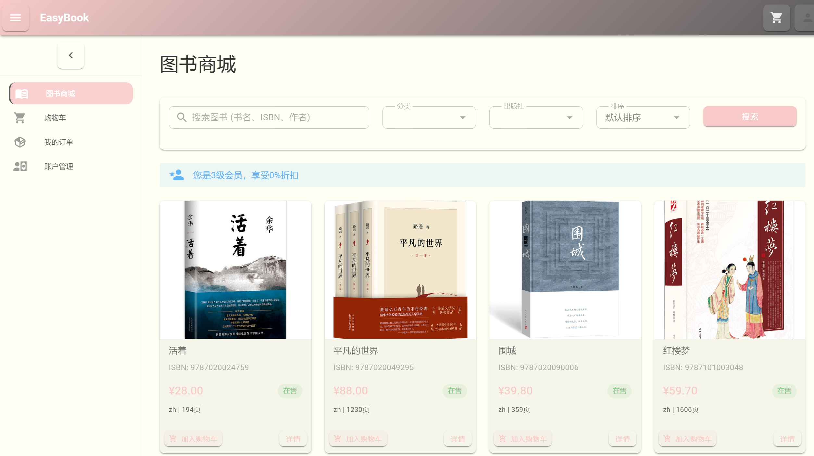
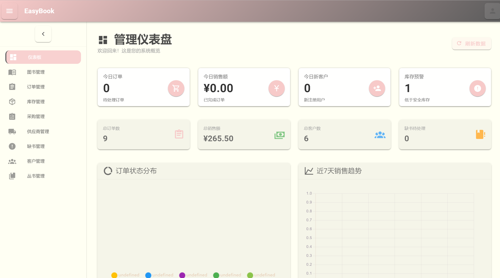

# HUST-EasyBook（网上书店管理系统）

本项目是《数据库系统原理》课程设计：一个面向书店业务的**网上书店管理系统**。

- **外部（B/S）**：顾客通过 Internet 进行图书浏览/查询、下单、查看订单等。
- **内部（类 C/S 管理端）**：管理员进行库存、采购、订单发货、供应商、客户等日常管理。
- **设计重点**：将关键业务规则尽量下沉到数据库端（存储过程/触发器），减少应用层多次往返并提升并发一致性。

## 主要功能模块

### 顾客侧

- 图书浏览与查询（书名/ISBN/分类/出版社等）
- 购物车
- 订单管理：下单、支付确认、取消/删除、确认收货
- 账户与资料：查看资料、修改资料、修改密码、注销账户（软删除）

### 管理员侧

- 仪表盘：订单/销售/库存预警等统计
- 库存管理：入库、出库、盘点、低库存预警
- 采购管理：采购单创建/审批/收货（收货触发库存自动更新）
- 缺书管理：缺书登记/扫描、标记处理、通知（可选）
- 供应商管理：供应商信息、供应商供货信息（供应商-图书关联）
- 客户管理：查询/筛选、充值、调整信用等级、冻结/解冻/关闭
- 丛书管理：丛书增删改查、查询丛书包含图书

## 技术栈

- **数据库**：MySQL 8
- **后端**：Java / Spring Boot + MyBatis
- **前端**：Vue 3 + Vite + TypeScript + Vuetify

## 项目结构（概览）

- `backend/`：后端服务（Spring Boot）
- `frontend/`：前端（Vue 3）
- `bookstoreonline.sql`：建表、测试数据、存储过程与触发器
- `数据库设计文档.md`：数据库设计说明与业务规则

## 数据库端业务规则（用于体现“规则尽量靠近数据”）

项目中将部分关键规则放在数据库端实现，以提升一致性与性能：

- 存储过程（示例）：
  - `sp_pay_order`：订单支付确认（不扣款，只更新状态）
  - `sp_process_delivery`：发货处理（扣款、扣库存、释放预留等）
  - `sp_recharge`：账户充值
- 触发器（示例）：
  - `tr_purchase_received`：采购收货时自动更新库存并更新采购状态
  - `tr_book_status_update`：库存为 0 自动标记图书缺货/恢复
  - `tr_limit_book_keywords`：限制每本书最多 10 个关键字

> 具体表结构与对象定义请参见 `数据库设计文档.md` 与 `bookstoreonline.sql`。

## 快速开始（本地开发）

> 说明：不同同学的环境差异较大（MySQL 账号、端口、Node/Java 版本等），这里给出高层步骤；具体参数以各自机器配置与项目内配置文件为准。

1. **导入数据库**

   - 创建数据库（如 `bookstoreonline`）
   - 导入 `bookstoreonline.sql`
   - 确认存储过程与触发器已创建
2. **启动后端**

   - 进入 `backend/`，按项目提供的 Maven Wrapper 启动
3. **启动前端**

   - 进入 `frontend/`，安装依赖并启动开发服务器

## 测试建议（验收关键点）

- 采购收货只应让库存增加一次（避免应用层与触发器重复累加）
- 支付阶段不扣款；发货阶段才扣款（符合业务流程设计）
- 库存扣减/预留应具备并发一致性保护（避免超卖）

---

如需更详细的数据库设计、业务流与规则说明，请阅读：

- `数据库设计文档.md`

## 系统截图演示

用户侧：

管理员侧：

