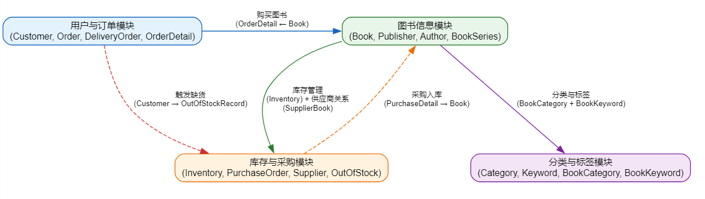
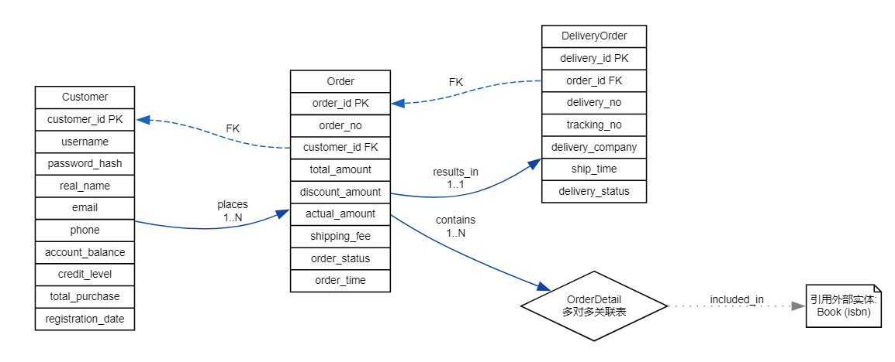
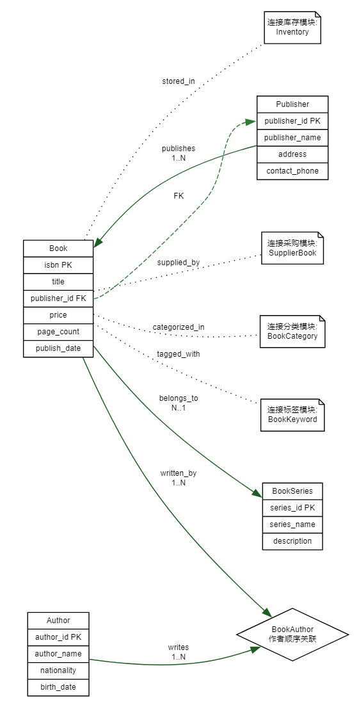
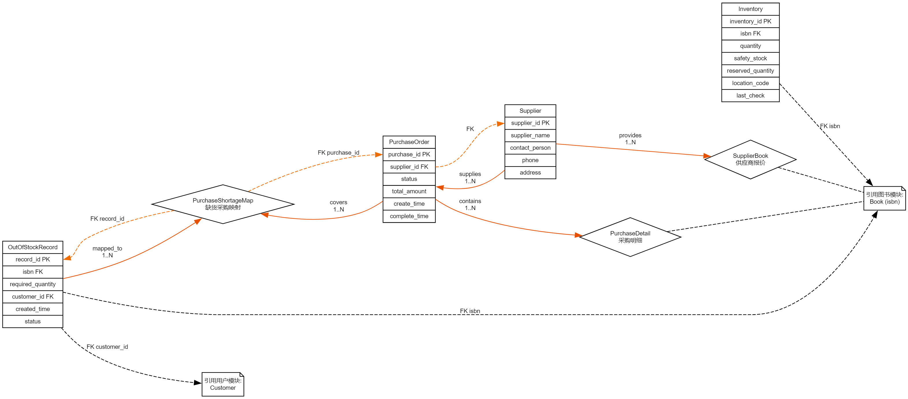
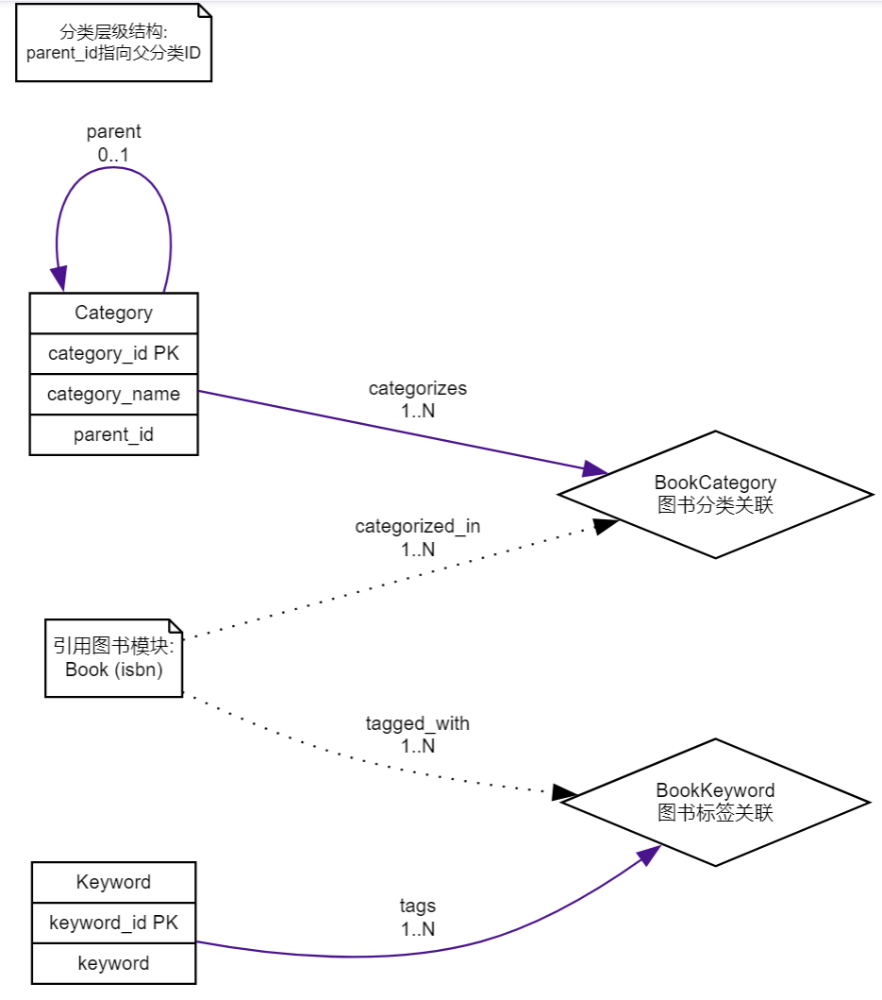

# 网上书店管理系统数据库设计文档

> 姓名：加鹿鸣，肖弘基
>
> 班级：软件2305班
>
> 学号：U202317327，U202317334

## 1. 引言

### 1.1 编写目的

本文档旨在为“网上书店管理系统”的数据库开发提供详细的技术蓝图。作为系统详细设计阶段的核心产物，本文档将需求分析阶段产生的用户需求转化为具体的数据库逻辑模型和物理模型。它不仅是数据库管理员（DBA）进行建库、配置和维护的直接依据，也是软件开发人员编写后端业务逻辑代码（DAL层）的重要参考。

### 1.2 背景与依据

随着电子商务的普及，传统书店面临着运营成本高、覆盖范围窄的挑战。本项目旨在构建一个混合架构系统：内部采用C/S模式处理高频、复杂的管理业务（如库存盘点、采购审批）；外部采用B/S模式向广域网用户提供购书服务。本设计依据《网上书店管理系统需求分析报告》进行，重点解决图书多作者管理、库存并发控制、复杂的客户信用等级计算以及缺书自动预警等关键问题。

## 2. 需求分析回顾

### 2.1 数据处理特点

本系统的数据处理具有以下显著特征，直接影响数据库设计：

1. **读写分离需求**：网上浏览（SELECT操作）并发量极大，而内部管理（INSERT/UPDATE）相对低频但事务完整性要求高。
2. **数据一致性**：库存扣减必须严格准确，防止超卖。
3. **历史数据追溯**：图书价格变动不应影响历史订单的金额记录。

### 2.2 核心业务流

1. **库存流**：入库 -> 库存增加 -> 订单锁定 -> 发货扣减。
2. **资金流**：充值 -> 余额增加 -> 下单冻结 -> 发货实扣 -> 积分/信用更新。
3. **信息流**：缺书登记 -> 汇总采购 -> 到货通知。

## 3. 概念结构设计

### 3.1 概念设计概述

本数据库设计基于网上书店管理系统的需求分析，采用实体-联系模型（E-R模型）作为概念设计的核心工具。系统需要处理的主要业务包括：供书目录管理、库存管理、采购管理、客户管理、订单管理、发货管理和供应商管理。根据需求分析，系统需要支持B/S和C/S两种访问模式，并将业务规则尽量放在数据库服务器端实现。

### 3.2 实体识别与分析

根据需求分析，识别出以下主要实体：

1. **图书（Book）**：书店销售的商品实体
2. **作者（Author）**：图书的作者实体
3. **出版社（Publisher）**：图书的出版单位实体
4. **客户（Customer）**：购书的客户实体
5. **订单（Order）**：客户下单的实体
6. **订单明细（OrderDetail）**：订单中具体图书的实体
7. **供应商（Supplier）**：提供图书的供应商实体
8. **库存（Inventory）**：图书库存的实体
9. **采购单（PurchaseOrder）**：书店向供应商采购的实体
10. **缺书记录（OutOfStockRecord）**：图书缺货的实体
11. **发货单（DeliveryOrder）**：发货的实体
12. **丛书（BookSeries）**：丛书系列的实体
13. **图书类别（Category）**：图书分类的实体
14. **关键字（Keyword）**：图书的关键字实体

### 3.3 子系统划分与实体分析

#### 3.3.1 图书管理子系统

**实体1：图书 (Book)**

* **标识符**：书号（ISBN）。本设计选用 ISBN 作为图书的唯一标识与主键，并以“版次（edition）”等属性区分不同版本信息。
* **属性**：
  * 基础信息：书名、出版社、版次、出版日期、定价。
  * 多媒体：封面图片路径、目录摘要（大文本）。
  * 库存：当前库存量、库存位置（如：A区-03架-2层）。
  * 扩展：关键字（多值属性，需规范化）、丛书标记。

**实体2：作者 (Author)**

* **属性**：作者姓名、生平简介。

**关系**：由于一本书可能有多个作者（有序），且一个作者写多本书，故图书与作者为 M:N 关系。

#### 3.3.2 客户与信用子系统

**实体1：客户 (Customer)**

* **属性**：网上ID、登录密码（加密）、姓名、联系地址、账户余额、累计购书额。

**实体2：信用等级 (CreditLevel)**

- **属性**：等级名称（一级~五级）、折扣率、透支限额。

**关系**：一个客户属于一个信用等级，一个等级包含多个客户 (N:1)。

#### 3.3.3 订单管理子系统

**实体：订单 (Order)**

**属性**：订单号、下单时间、发货地址、总金额、状态。

**关系**：

- 客户 - 订单 (1:N)。
- 订单 - 图书 (M:N)：产生“订单明细”关联实体，属性包含：订购数量、成交单价（记录下单时的瞬时价格）。

#### 3.3.4 采购管理子系统

**实体：供应商 (Supplier)**

- **属性**：名称、联系人、电话、Email。

**实体：缺书记录 (Shortage)**

- **属性**：登记日期、数量、状态（未处理/已采购）、来源（库存警报/客户预订）。

**关系**：

- 供应商 - 图书 (M:N)：同一本书可由多个供应商提供，且报价不同。

### 3.4 E-R模型设计

#### 3.4.1 总体E-R图



#### 3.4.2 各模块详细E-R图

##### 用户与订单模块



##### 图书信息模块



##### 库存采购模块



##### 分类标签模块



#### 3.4.3 核心数据流图


### 3.5 关键联系的基数、可选性与业务规则（可落地约束）

为保证概念模型能够在 MySQL 8 中可实现验收，对题目关注的关键联系补充如下约定（与后续表结构/过程/触发器一致）：

#### 3.5.1 图书（Book）相关

1. **Book - Publisher：N:1（必选）**

   - 每本图书必须且只能对应一个出版社（`books.publisher_id NOT NULL`）。
   - 出版社可出版多本图书。
2. **Book - Author：M:N（必选，作者有序，最多4个）**

   - 通过 `book_authors(isbn, author_id, author_order)` 实现。
   - 约束：同一本书 `author_order` 取值 1~4，且同一ISBN下不得重复（建议唯一约束：`UNIQUE(isbn, author_order)`）。
3. **Book - Keyword：M:N（可选，最多10个）**

   - 通过 `book_keywords(isbn, keyword_id)` 实现。
   - 约束：每本书最多10个关键字（已通过触发器 `tr_limit_book_keywords` 约束）。
4. **Book - Inventory：1:1（必选）**

   - 每本书必须存在一条库存记录（`inventory.isbn UNIQUE`）。
   - 建议在“新书建档”时自动创建库存行（后续脚本可通过触发器或初始化语句实现）。

#### 3.5.2 订单（Order）与发货（Delivery）相关（方案A）

1. **Customer - Order：1:N（必选）**

   - 一个客户可有多个订单；每个订单必须属于一个客户。
2. **Order - OrderDetail：1:N（必选）**

   - 一个订单必须至少包含一条明细。
   - 订单明细记录“下单时成交单价/折扣率/小计”，用于保证历史订单不受后续价格变动影响。
3. **库存预留与扣减规则（核心验收点）**

   - 加入订单明细时：
     - 先检查可用库存（`quantity - reserved_quantity`），满足则增加 `reserved_quantity`。
   - 订单取消时：释放预留（减少 `reserved_quantity`）。
   - 发货时：在扣款成功后，减少 `quantity` 并减少 `reserved_quantity`。
   - 并发一致性：上述操作必须在事务中对 `inventory` 对应行加锁（`SELECT ... FOR UPDATE`），避免超卖。
4. **Order - DeliveryOrder：1:N（可选）**

   - 允许一个订单分多次发货（部分发货可选）。
   - 若课程实现不做“部分发货”，也至少要能生成1条发货单并记录物流信息。
5. **扣款时点（方案A）**

   - `paid`：代表支付已确认（或信用额度允许先发后付），但此阶段不扣减余额。
   - `shipped`：执行发货时扣减客户余额；余额/透支规则不满足则禁止发货。

#### 3.5.3 缺书（OutOfStockRecord）与采购（Purchase）相关

1. **缺书记录生成（必选）**

   - 来源包括：人工登记、库存预警自动生成、客户缺书登记（可选）。
2. **缺书记录“不能重复”（题目硬要求）**

   - 同一本书在未解决前只应存在一条“待处理缺书记录”（例如 `status in ('pending','processing')`）。
   - 实现策略（推荐组合）：
     - 约束：对 `out_of_stock_records` 增加唯一性约束（例如 `UNIQUE(isbn, status)` 的等价实现，或增加 `active_flag` 后 `UNIQUE(isbn, active_flag)`）。
     - 逻辑：触发器/过程在发现已存在待处理记录时改为“累加 required_quantity”，而不是插入新行。
3. **OutOfStockRecord - PurchaseOrder：M:N（推荐实现）**

   - 通过映射表 `purchase_shortage_map(purchase_id, record_id, mapped_quantity)` 实现。
   - 采购收货完成后：应将相关缺书记录标记为 `resolved`（或删除），并记录 `resolve_time`；客户登记的缺书请求可更新通知状态（Email 发送可选）。

### 3.6 实体与属性的划分原则

1. **原子性原则**：每个属性都是不可再分的数据项
2. **唯一标识原则**：每个实体必须有唯一标识属性（主键）
3. **依赖性原则**：非主键属性完全依赖于主键
4. **避免冗余原则**：相同信息不重复存储
5. **业务需求原则**：属性设计满足业务处理需求

## 4. 逻辑结构设计

### 4.1 关系模式转换

将E-R图转换为关系模型，并遵循3NF（第三范式）标准。

#### 4.1.1 基础信息表集

* **Books** (`<u>`ISBN `</u>`, Title, PublisherID, Price, SeriesID, ...)
* **Authors** (`<u>`AuthorID `</u>`, Name, Description)
* **Book_Author_Relation** (`<u>`ISBN, AuthorID `</u>`, SortOrder)
  * *说明*：SortOrder用于满足“第一作者、第二作者”的有序需求。
* **Publishers** (`<u>`PublisherID `</u>`, Name, Address)

#### 4.1.2 客户体系表集

* **CreditLevels** (`<u>`LevelID `</u>`, LevelName, DiscountRate, CanOverdraft, OverdraftLimit, UpgradeThreshold)
  * *优化*：将信用规则参数化存储，而非硬编码在程序中。
* **Customers** (`<u>`CustomerID `</u>`, LoginName, PasswordHash, RealName, Address, Balance, TotalSpend, CreditLevelID)

#### 4.1.3 业务流转表集

* **Orders** (`<u>`OrderID `</u>`, CustomerID, OrderDate, TotalOriginalAmt, TotalDiscountedAmt, ShipAddress, OrderStatus, PayDate, ShipDate)
* **OrderDetails** (`<u>`OrderID, ISBN `</u>`, Quantity, DealPrice)
* **Shortages** (`<u>`ShortageID `</u>`, ISBN, RequestQty, CreatedDate, SourceType, Status, CustomerID_Ref)
* **Suppliers** (`<u>`SupplierID `</u>`, Name, ContactInfo)
* **Supplier_Book_Map** (`<u>`SupplierID, ISBN `</u>`, QuotePrice)
* **PurchaseOrders** (`<u>`PurchaseID `</u>`, SupplierID, CreatedDate, Status)
* **PurchaseOrderDetails** (`<u>`PurchaseID, ISBN `</u>`, Qty, CostPrice)

### 4.2 数据模型优化

1. **反规范化设计**：在 `Orders` 表中冗余存储 `TotalDiscountedAmt`。虽然可以根据明细动态计算，但考虑到订单量大，且历史折扣率可能调整，存储最终成交价能提高报表查询性能并保证数据历史真实性。
2. **水平分割（可选）**：若订单表超过1000万行，可考虑按 `OrderDate`（年份）进行分区存储（Partitioning）。

### 4.3 用户外模式（视图设计）

* `View_Book_Search`：连接Books, Publishers, 和聚合后的Authors字符串，用于前台快速搜索。
* `View_My_Orders`：过滤当前登录用户的订单及状态描述。

### 4.4 实现约定与脚本执行顺序（便于验收/落地）

为避免外键、触发器依赖导致"执行顺序错误"，建议按如下顺序创建数据库对象（后续SQL脚本也将遵循此顺序）：

1. **Schema / Base Tables**：先建基础表（publishers、authors、books、customers、credit_rules、suppliers…）
2. **Relation Tables**：再建关系表（book_authors、book_keywords、book_categories、supplier_books…）
3. **Business Tables**：再建业务流表（inventory、orders、order_details、out_of_stock_records、purchase_orders、purchase_details、delivery_orders、delivery_details…）
4. **Constraints & Indexes**：补充唯一约束、外键、索引
5. **Views**：创建视图（依赖多表）
6. **Routines**：创建存储过程/函数（依赖表/视图）
7. **Triggers**：最后创建触发器（依赖表/过程/约束），并进行基本用例验证

> 说明：
>
> - MySQL 8 的外键要求被引用列存在索引；因此在加外键前应确保主键/唯一索引已创建。
> - 涉及并发一致性的业务过程（库存预留/扣减、扣款）必须使用事务与行锁（`FOR UPDATE`）。

## 5. 表结构设计

### 5.1 核心表设计

#### 5.1.1 图书表 (books)

| 字段名            | 数据类型 | 长度 | 是否为空 | 默认值            | 说明         | 约束                                                                 |
| ----------------- | -------- | ---- | -------- | ----------------- | :----------- | -------------------------------------------------------------------- |
| isbn              | VARCHAR  | 20   | NOT NULL |                   | 国际标准书号 | 主键                                                                 |
| title             | VARCHAR  | 200  | NOT NULL |                   | 书名         |                                                                      |
| edition           | VARCHAR  | 10   |          |                   | 版次         |                                                                      |
| publisher_id      | VARCHAR  | 10   | NOT NULL |                   | 出版社ID     | 外键                                                                 |
| publish_date      | DATE     |      |          |                   | 出版日期     |                                                                      |
| price             | DECIMAL  | 10,2 | NOT NULL | 0.00              | 售价         | CHECK(price>=0)                                                      |
| page_count        | INT      |      |          | 0                 | 页数         |                                                                      |
| format            | VARCHAR  | 20   |          |                   | 开本         |                                                                      |
| language          | VARCHAR  | 10   | NOT NULL | 'zh'              | 语言         |                                                                      |
| description       | TEXT     |      |          |                   | 简介         |                                                                      |
| table_of_contents | TEXT     |      |          |                   | 目录         |                                                                      |
| cover_image       | VARCHAR  | 200  |          |                   | 封面图片路径 |                                                                      |
| series_id         | VARCHAR  | 10   |          |                   | 丛书ID       | 外键                                                                 |
| book_type         | VARCHAR  | 10   | NOT NULL | 'normal'          | 图书类型     | CHECK(book_type IN ('normal','ebook','audio'))                       |
| status            | VARCHAR  | 10   | NOT NULL | 'active'          | 状态         | CHECK(status IN ('active','inactive','out_of_print','out_of_stock')) |
| create_time       | DATETIME |      | NOT NULL | CURRENT_TIMESTAMP | 创建时间     |                                                                      |
| update_time       | DATETIME |      | NOT NULL | CURRENT_TIMESTAMP | 更新时间     |                                                                      |

#### 5.1.2 出版社表 (publishers)

| 字段名         | 数据类型 | 长度 | 是否为空 | 默认值            | 说明       | 约束     |
| -------------- | -------- | ---- | -------- | ----------------- | ---------- | -------- |
| publisher_id   | VARCHAR  | 10   | NOT NULL |                   | 出版社ID   | 主键     |
| publisher_name | VARCHAR  | 100  | NOT NULL |                   | 出版社名称 | 唯一索引 |
| address        | VARCHAR  | 200  |          |                   | 地址       |          |
| contact_phone  | VARCHAR  | 20   |          |                   | 联系电话   |          |
| contact_person | VARCHAR  | 50   |          |                   | 联系人     |          |
| email          | VARCHAR  | 100  |          |                   | 邮箱       |          |
| website        | VARCHAR  | 100  |          |                   | 网站       |          |
| description    | TEXT     |      |          |                   | 简介       |          |
| create_time    | DATETIME |      | NOT NULL | CURRENT_TIMESTAMP | 创建时间   |          |
| update_time    | DATETIME |      | NOT NULL | CURRENT_TIMESTAMP | 更新时间   |          |

#### 5.1.3 作者表 (authors)

| 字段名      | 数据类型 | 长度 | 是否为空 | 默认值            | 说明     | 约束 |
| ----------- | -------- | ---- | -------- | ----------------- | -------- | ---- |
| author_id   | VARCHAR  | 10   | NOT NULL |                   | 作者ID   | 主键 |
| author_name | VARCHAR  | 50   | NOT NULL |                   | 作者姓名 |      |
| nationality | VARCHAR  | 20   |          |                   | 国籍     |      |
| birth_date  | DATE     |      |          |                   | 出生日期 |      |
| biography   | TEXT     |      |          |                   | 作者简介 |      |
| create_time | DATETIME |      | NOT NULL | CURRENT_TIMESTAMP | 创建时间 |      |

#### 5.1.4 图书作者表 (book_authors)

| 字段名       | 数据类型 | 长度 | 是否为空 | 默认值   | 说明     | 约束                                                            |
| ------------ | -------- | ---- | -------- | -------- | -------- | --------------------------------------------------------------- |
| isbn         | VARCHAR  | 20   | NOT NULL |          | 图书ISBN | 外键,复合主键                                                   |
| author_id    | VARCHAR  | 10   | NOT NULL |          | 作者ID   | 外键,复合主键                                                   |
| author_order | TINYINT  |      | NOT NULL | 1        | 作者顺序 | CHECK(author_order BETWEEN 1 AND 4), UNIQUE(isbn, author_order) |
| author_type  | VARCHAR  | 10   | NOT NULL | 'author' | 作者类型 | CHECK(author_type IN ('author','translator','editor'))          |

**约束说明**：

- `UNIQUE(isbn, author_order)`：确保同一本书的作者顺序不能重复（如不能有两个第一作者）

#### 5.1.5 客户表 (customers)

| 字段名            | 数据类型 | 长度 | 是否为空 | 默认值            | 说明         | 约束                                                                          |
| ----------------- | -------- | ---- | -------- | ----------------- | ------------ | ----------------------------------------------------------------------------- |
| customer_id       | VARCHAR  | 10   | NOT NULL |                   | 客户ID       | 主键                                                                          |
| username          | VARCHAR  | 50   | NOT NULL |                   | 用户名       | 唯一索引                                                                      |
| password_hash     | VARCHAR  | 100  | NOT NULL |                   | 密码哈希值   |                                                                               |
| real_name         | VARCHAR  | 50   | NOT NULL |                   | 真实姓名     |                                                                               |
| email             | VARCHAR  | 100  | NOT NULL |                   | 邮箱         | 唯一索引                                                                      |
| phone             | VARCHAR  | 20   |          |                   | 电话         |                                                                               |
| address           | VARCHAR  | 200  |          |                   | 地址         |                                                                               |
| account_balance   | DECIMAL  | 10,2 | NOT NULL | 0.00              | 账户余额     |                                                                               |
| credit_level      | INT      |      | NOT NULL | 1                 | 信用等级     | CHECK(credit_level BETWEEN 1 AND 5)（建议：外键关联 `credit_rules(level)`） |
| total_purchase    | DECIMAL  | 12,2 | NOT NULL | 0.00              | 累计消费金额 |                                                                               |
| registration_date | DATETIME |      | NOT NULL | CURRENT_TIMESTAMP | 注册日期     |                                                                               |
| last_login        | DATETIME |      |          |                   | 最后登录时间 |                                                                               |
| account_status    | VARCHAR  | 10   | NOT NULL | 'active'          | 账户状态     | CHECK(account_status IN ('active','frozen','closed'))                         |

#### 5.1.6 订单表 (orders)

| 字段名           | 数据类型 | 长度 | 是否为空 | 默认值            | 说明         | 约束                                                                                                |
| ---------------- | -------- | ---- | -------- | ----------------- | :----------- | --------------------------------------------------------------------------------------------------- |
| order_id         | VARCHAR  | 20   | NOT NULL |                   | 订单ID       | 主键                                                                                                |
| order_no         | VARCHAR  | 30   | NOT NULL |                   | 订单号       | 唯一索引                                                                                            |
| customer_id      | VARCHAR  | 10   | NOT NULL |                   | 客户ID       | 外键                                                                                                |
| total_amount     | DECIMAL  | 12,2 | NOT NULL | 0.00              | 商品原价合计 | 说明：明细原价累计（`unit_price * quantity`），不含折扣                                           |
| discount_amount  | DECIMAL  | 10,2 | NOT NULL | 0.00              | 折扣金额合计 | 说明：折扣让利金额累计（原价 * 折扣率），不含运费                                                   |
| actual_amount    | DECIMAL  | 12,2 | NOT NULL | 0.00              | 应付金额合计 | 说明：折后应付累计（原价合计 - 折扣额），本设计用于发货扣款金额（方案A：发货时扣款）                |
| shipping_fee     | DECIMAL  | 8,2  | NOT NULL | 0.00              | 运费         |                                                                                                     |
| order_status     | VARCHAR  | 20   | NOT NULL | 'pending'         | 订单状态     | CHECK(order_status IN ('pending','paid','processing','shipped','delivered','cancelled','refunded')) |
| shipping_address | VARCHAR  | 200  | NOT NULL |                   | 收货地址     |                                                                                                     |
| recipient_name   | VARCHAR  | 50   | NOT NULL |                   | 收货人姓名   |                                                                                                     |
| recipient_phone  | VARCHAR  | 20   | NOT NULL |                   | 收货人电话   |                                                                                                     |
| payment_method   | VARCHAR  | 20   |          |                   | 支付方式     |                                                                                                     |
| payment_time     | DATETIME |      |          |                   | 支付时间     |                                                                                                     |
| order_time       | DATETIME |      | NOT NULL | CURRENT_TIMESTAMP | 下单时间     |                                                                                                     |
| shipping_time    | DATETIME |      |          |                   | 发货时间     |                                                                                                     |
| delivery_time    | DATETIME |      |          |                   | 送达时间     |                                                                                                     |
| notes            | TEXT     |      |          |                   | 订单备注     |                                                                                                     |

> **说明**：
>
> - `paid` 表示支付已确认（或信用允许先发后付），此时仅记录 `payment_time`，不扣减余额。
> - `sp_process_delivery` 发货时以 `actual_amount` 作为扣款金额，从客户余额中扣除；扣款成功后订单置为 `shipped`。

#### 5.1.7 订单明细表 (order_details)

| 字段名        | 数据类型 | 长度 | 是否为空 | 默认值 | 说明     | 约束                                 |
| ------------- | -------- | ---- | -------- | ------ | -------- | ------------------------------------ |
| detail_id     | VARCHAR  | 20   | NOT NULL |        | 明细ID   | 主键                                 |
| order_id      | VARCHAR  | 20   | NOT NULL |        | 订单ID   | 外键                                 |
| isbn          | VARCHAR  | 20   | NOT NULL |        | 图书ISBN | 外键                                 |
| quantity      | INT      |      | NOT NULL | 1      | 数量     | CHECK(quantity > 0)                  |
| unit_price    | DECIMAL  | 10,2 | NOT NULL |        | 单价     |                                      |
| discount_rate | DECIMAL  | 5,4  | NOT NULL | 0.0000 | 折扣率   | CHECK(discount_rate BETWEEN 0 AND 1) |
| subtotal      | DECIMAL  | 10,2 | NOT NULL |        | 小计     |                                      |

#### 5.1.8 库存表 (inventory)

| 字段名            | 数据类型 | 长度 | 是否为空 | 默认值            | 说明         | 约束                          |
| ----------------- | -------- | ---- | -------- | ----------------- | ------------ | ----------------------------- |
| inventory_id      | VARCHAR  | 20   | NOT NULL |                   | 库存ID       | 主键                          |
| isbn              | VARCHAR  | 20   | NOT NULL |                   | 图书ISBN     | 外键,唯一索引                 |
| quantity          | INT      |      | NOT NULL | 0                 | 当前数量     | CHECK(quantity >= 0)          |
| safety_stock      | INT      |      | NOT NULL | 10                | 安全库存     | CHECK(safety_stock >= 0)      |
| reserved_quantity | INT      |      | NOT NULL | 0                 | 预留数量     | CHECK(reserved_quantity >= 0) |
| location_code     | VARCHAR  | 20   |          |                   | 存放位置编码 |                               |
| warehouse         | VARCHAR  | 20   | NOT NULL | 'main'            | 仓库         |                               |
| last_restock      | DATETIME |      |          |                   | 最后补货时间 |                               |
| last_check        | DATETIME |      | NOT NULL | CURRENT_TIMESTAMP | 最后盘点时间 |                               |

#### 5.1.9 供应商表 (suppliers)

| 字段名             | 数据类型 | 长度 | 是否为空 | 默认值            | 说明       | 约束                                                             |
| ------------------ | -------- | ---- | -------- | ----------------- | ---------- | ---------------------------------------------------------------- |
| supplier_id        | VARCHAR  | 10   | NOT NULL |                   | 供应商ID   | 主键                                                             |
| supplier_name      | VARCHAR  | 100  | NOT NULL |                   | 供应商名称 |                                                                  |
| contact_person     | VARCHAR  | 50   | NOT NULL |                   | 联系人     |                                                                  |
| contact_phone      | VARCHAR  | 20   | NOT NULL |                   | 联系电话   |                                                                  |
| email              | VARCHAR  | 100  | NOT NULL |                   | 邮箱       |                                                                  |
| address            | VARCHAR  | 200  | NOT NULL |                   | 地址       |                                                                  |
| bank_account       | VARCHAR  | 50   |          |                   | 银行账户   |                                                                  |
| tax_number         | VARCHAR  | 30   |          |                   | 税号       |                                                                  |
| cooperation_status | VARCHAR  | 10   | NOT NULL | 'active'          | 合作状态   | CHECK(cooperation_status IN ('active','suspended','terminated')) |
| rating             | DECIMAL  | 3,2  |          | 5.00              | 评分       | CHECK(rating BETWEEN 0 AND 5)                                    |
| create_time        | DATETIME |      | NOT NULL | CURRENT_TIMESTAMP | 创建时间   |                                                                  |
| update_time        | DATETIME |      | NOT NULL | CURRENT_TIMESTAMP | 更新时间   |                                                                  |

#### 5.1.10 采购单表 (purchase_orders)

| 字段名            | 数据类型 | 长度 | 是否为空 | 默认值            | 说明         | 约束                                                                               |
| ----------------- | -------- | ---- | -------- | ----------------- | ------------ | ---------------------------------------------------------------------------------- |
| purchase_id       | VARCHAR  | 20   | NOT NULL |                   | 采购单ID     | 主键                                                                               |
| purchase_no       | VARCHAR  | 30   | NOT NULL |                   | 采购单号     | 唯一索引                                                                           |
| supplier_id       | VARCHAR  | 10   | NOT NULL |                   | 供应商ID     | 外键                                                                               |
| total_amount      | DECIMAL  | 12,2 | NOT NULL | 0.00              | 总金额       |                                                                                    |
| status            | VARCHAR  | 20   | NOT NULL | 'draft'           | 状态         | CHECK(status IN ('draft','submitted','approved','ordered','received','cancelled')) |
| order_date        | DATE     |      |          |                   | 订购日期     |                                                                                    |
| expected_delivery | DATE     |      |          |                   | 预计送达日期 |                                                                                    |
| actual_delivery   | DATE     |      |          |                   | 实际送达日期 |                                                                                    |
| create_time       | DATETIME |      | NOT NULL | CURRENT_TIMESTAMP | 创建时间     |                                                                                    |
| create_by         | VARCHAR  | 10   | NOT NULL |                   | 创建人       |                                                                                    |
| approve_time      | DATETIME |      |          |                   | 审批时间     |                                                                                    |
| approve_by        | VARCHAR  | 10   |          |                   | 审批人       |                                                                                    |

#### 5.1.11 采购明细表 (purchase_details)

| 字段名            | 数据类型 | 长度 | 是否为空 | 默认值    | 说明       | 约束                                                            |
| ----------------- | -------- | ---- | -------- | --------- | ---------- | --------------------------------------------------------------- |
| detail_id         | VARCHAR  | 20   | NOT NULL |           | 明细ID     | 主键                                                            |
| purchase_id       | VARCHAR  | 20   | NOT NULL |           | 采购单ID   | 外键                                                            |
| isbn              | VARCHAR  | 20   | NOT NULL |           | 图书ISBN   | 外键                                                            |
| quantity          | INT      |      | NOT NULL | 1         | 采购数量   | CHECK(quantity > 0)                                             |
| unit_price        | DECIMAL  | 10,2 | NOT NULL |           | 采购单价   | CHECK(unit_price >= 0)                                          |
| received_quantity | INT      |      | NOT NULL | 0         | 已收货数量 | CHECK(received_quantity >= 0 AND received_quantity <= quantity) |
| status            | VARCHAR  | 20   | NOT NULL | 'pending' | 状态       | CHECK(status IN ('pending','partial','complete'))               |

### 5.2 辅助表设计

#### 5.2.1 缺书记录表 (out_of_stock_records)

| 字段名            | 数据类型 | 长度 | 是否为空 | 默认值            | 说明           | 约束                                                               |
| ----------------- | -------- | ---- | -------- | ----------------- | -------------- | ------------------------------------------------------------------ |
| record_id         | VARCHAR  | 20   | NOT NULL |                   | 记录ID         | 主键                                                               |
| isbn              | VARCHAR  | 20   | NOT NULL |                   | 图书ISBN       | 外键                                                               |
| book_title        | VARCHAR  | 200  |          |                   | 图书名称       | 冗余存储，便于查询                                                 |
| publisher_name    | VARCHAR  | 100  |          |                   | 出版社名称     | 冗余存储，便于查询                                                 |
| required_quantity | INT      |      | NOT NULL | 1                 | 需求数量       | CHECK(required_quantity > 0)                                       |
| customer_id       | VARCHAR  | 10   |          |                   | 客户ID         | 外键                                                               |
| customer_email    | VARCHAR  | 100  |          |                   | 客户邮箱       | 用于到货通知                                                       |
| customer_phone    | VARCHAR  | 20   |          |                   | 客户电话       | 用于到货通知                                                       |
| source_type       | VARCHAR  | 20   | NOT NULL | 'manual'          | 来源类型       | CHECK(source_type IN ('manual','auto','customer'))                 |
| priority          | INT      |      | NOT NULL | 1                 | 优先级         | CHECK(priority BETWEEN 1 AND 5)                                    |
| status            | VARCHAR  | 20   | NOT NULL | 'pending'         | 状态           | CHECK(status IN ('pending','processing','resolved','cancelled'))   |
| notify_status     | VARCHAR  | 20   | NOT NULL | 'not_required'    | 通知状态       | CHECK(notify_status IN ('not_required','pending','sent','failed')) |
| notify_time       | DATETIME |      |          |                   | 通知时间       |                                                                    |
| created_time      | DATETIME |      | NOT NULL | CURRENT_TIMESTAMP | 登记时间(创建) |                                                                    |
| resolve_time      | DATETIME |      |          |                   | 解决时间       |                                                                    |
| remark            | TEXT     |      |          |                   | 备注           | 客户的缺书请求说明                                                 |

**字段说明**：

- `customer_email`/`customer_phone`：当客户在网上进行缺书登记时记录联系方式，用于到货后通知
- `notify_status`：跟踪通知状态，`not_required`表示无需通知（非客户登记），`pending`待通知，`sent`已通知，`failed`通知失败
- `book_title`/`publisher_name`：冗余存储图书和出版社信息，即使图书信息变更也能保持记录准确性

#### 5.2.2 发货单表 (delivery_orders)

| 字段名           | 数据类型 | 长度 | 是否为空 | 默认值      | 说明         | 约束                                                                                  |
| ---------------- | -------- | ---- | -------- | ----------- | ------------ | ------------------------------------------------------------------------------------- |
| delivery_id      | VARCHAR  | 20   | NOT NULL |             | 发货单ID     | 主键                                                                                  |
| order_id         | VARCHAR  | 20   | NOT NULL |             | 订单ID       | 外键                                                                                  |
| delivery_no      | VARCHAR  | 30   | NOT NULL |             | 发货单号     | 唯一索引                                                                              |
| delivery_company | VARCHAR  | 50   | NOT NULL |             | 物流公司     |                                                                                       |
| tracking_no      | VARCHAR  | 50   |          |             | 物流单号     |                                                                                       |
| delivery_address | VARCHAR  | 200  | NOT NULL |             | 收货地址     |                                                                                       |
| delivery_status  | VARCHAR  | 20   | NOT NULL | 'preparing' | 发货状态     | CHECK(delivery_status IN ('preparing','shipped','in_transit','delivered','returned')) |
| shipping_fee     | DECIMAL  | 8,2  | NOT NULL | 0.00        | 运费         |                                                                                       |
| weight           | DECIMAL  | 8,2  |          |             | 重量(kg)     |                                                                                       |
| package_count    | INT      |      | NOT NULL | 1           | 包裹数量     |                                                                                       |
| prepare_time     | DATETIME |      |          |             | 配货时间     |                                                                                       |
| ship_time        | DATETIME |      |          |             | 发货时间     |                                                                                       |
| expected_arrival | DATE     |      |          |             | 预计到达日期 |                                                                                       |
| actual_arrival   | DATE     |      |          |             | 实际到达日期 |                                                                                       |
| notes            | TEXT     |      |          |             | 备注         |                                                                                       |

#### 5.2.3 发货明细表 (delivery_details)

| 字段名          | 数据类型 | 长度 | 是否为空 | 默认值 | 说明       | 约束                |
| --------------- | -------- | ---- | -------- | ------ | ---------- | ------------------- |
| detail_id       | VARCHAR  | 20   | NOT NULL |        | 明细ID     | 主键                |
| delivery_id     | VARCHAR  | 20   | NOT NULL |        | 发货单ID   | 外键                |
| order_detail_id | VARCHAR  | 20   | NOT NULL |        | 订单明细ID | 外键                |
| quantity        | INT      |      | NOT NULL | 1      | 发货数量   | CHECK(quantity > 0) |
| package_no      | VARCHAR  | 20   |          |        | 包裹编号   |                     |

#### 5.2.4 信用等级规则表 (credit_rules)

| 字段名             | 数据类型 | 长度 | 是否为空 | 默认值 | 说明             | 约束                                 |
| ------------------ | -------- | ---- | -------- | ------ | ---------------- | ------------------------------------ |
| level              | INT      |      | NOT NULL |        | 信用等级         | 主键                                 |
| level_name         | VARCHAR  | 20   | NOT NULL |        | 等级名称         |                                      |
| discount_rate      | DECIMAL  | 5,4  | NOT NULL | 0.0000 | 折扣率           | CHECK(discount_rate BETWEEN 0 AND 1) |
| overdraft_enabled  | BOOLEAN  |      | NOT NULL | FALSE  | 允许透支         |                                      |
| overdraft_limit    | DECIMAL  | 10,2 |          |        | 透支额度         |                                      |
| min_balance        | DECIMAL  | 10,2 |          |        | 最低账户余额要求 |                                      |
| min_total_purchase | DECIMAL  | 12,2 |          |        | 最低累计消费要求 |                                      |
| description        | TEXT     |      |          |        | 等级描述         |                                      |

**信用等级规则初始化数据**（根据需求规定）：

```sql
INSERT INTO credit_rules (level, level_name, discount_rate, overdraft_enabled, overdraft_limit, min_balance, min_total_purchase, description) VALUES
(1, '一级会员', 0.10, FALSE, NULL, NULL, 0.00, '10%折扣，不能透支'),
(2, '二级会员', 0.15, FALSE, NULL, NULL, 1000.00, '15%折扣，不能透支'),
(3, '三级会员', 0.15, TRUE, 500.00, NULL, 2000.00, '15%折扣，可透支500元'),
(4, '四级会员', 0.20, TRUE, 1000.00, NULL, 5000.00, '20%折扣，可透支1000元'),
(5, '五级会员', 0.25, TRUE, NULL, NULL, 10000.00, '25%折扣，透支无限额');
```

**等级说明**：

| 等级 | 折扣 | 透支权限 | 透支额度 | 升级条件（累计消费） |
| ---- | ---- | -------- | -------- | -------------------- |
| 一级 | 10%  | 不能透支 | -        | 新注册用户           |
| 二级 | 15%  | 不能透支 | -        | 累计消费≥1000元     |
| 三级 | 15%  | 可透支   | 500元    | 累计消费≥2000元     |
| 四级 | 20%  | 可透支   | 1000元   | 累计消费≥5000元     |
| 五级 | 25%  | 可透支   | 无限额   | 累计消费≥10000元    |

#### 5.2.5 关键字表 (keywords)

| 字段名       | 数据类型 | 长度 | 是否为空 | 默认值            | 说明     | 约束     |
| ------------ | -------- | ---- | -------- | ----------------- | -------- | -------- |
| keyword_id   | VARCHAR  | 10   | NOT NULL |                   | 关键字ID | 主键     |
| keyword      | VARCHAR  | 50   | NOT NULL |                   | 关键字   | 唯一索引 |
| search_count | INT      |      | NOT NULL | 0                 | 搜索次数 |          |
| create_time  | DATETIME |      | NOT NULL | CURRENT_TIMESTAMP | 创建时间 |          |

#### 5.2.6 图书关键字表 (book_keywords)

| 字段名     | 数据类型 | 长度 | 是否为空 | 默认值 | 说明     | 约束                             |
| ---------- | -------- | ---- | -------- | ------ | -------- | -------------------------------- |
| isbn       | VARCHAR  | 20   | NOT NULL |        | 图书ISBN | 外键,复合主键                    |
| keyword_id | VARCHAR  | 10   | NOT NULL |        | 关键字ID | 外键,复合主键                    |
| relevance  | DECIMAL  | 3,2  | NOT NULL | 1.00   | 相关度   | CHECK(relevance BETWEEN 0 AND 1) |

#### 5.2.7 类别表 (categories)

| 字段名        | 数据类型 | 长度 | 是否为空 | 默认值 | 说明     | 约束 |
| ------------- | -------- | ---- | -------- | ------ | -------- | ---- |
| category_id   | VARCHAR  | 10   | NOT NULL |        | 类别ID   | 主键 |
| category_name | VARCHAR  | 50   | NOT NULL |        | 类别名称 |      |
| parent_id     | VARCHAR  | 10   |          |        | 父类别ID | 外键 |
| level         | INT      |      | NOT NULL | 1      | 层级     |      |
| display_order | INT      |      | NOT NULL | 1      | 显示顺序 |      |
| description   | TEXT     |      |          |        | 描述     |      |

#### 5.2.8 图书类别表 (book_categories)

| 字段名      | 数据类型 | 长度 | 是否为空 | 默认值 | 说明     | 约束          |
| ----------- | -------- | ---- | -------- | ------ | -------- | ------------- |
| isbn        | VARCHAR  | 20   | NOT NULL |        | 图书ISBN | 外键,复合主键 |
| category_id | VARCHAR  | 10   | NOT NULL |        | 类别ID   | 外键,复合主键 |

#### 5.2.9 丛书表 (book_series)

| 字段名       | 数据类型 | 长度 | 是否为空 | 默认值 | 说明     | 约束 |
| ------------ | -------- | ---- | -------- | ------ | -------- | ---- |
| series_id    | VARCHAR  | 10   | NOT NULL |        | 丛书ID   | 主键 |
| series_name  | VARCHAR  | 100  | NOT NULL |        | 丛书名称 |      |
| publisher_id | VARCHAR  | 10   |          |        | 出版社ID | 外键 |
| total_books  | INT      |      |          |        | 总册数   |      |
| description  | TEXT     |      |          |        | 描述     |      |

#### 5.2.10 供应商图书表 (supplier_books)

| 字段名             | 数据类型 | 长度 | 是否为空 | 默认值            | 说明         | 约束                          |
| ------------------ | -------- | ---- | -------- | ----------------- | ------------ | ----------------------------- |
| supplier_id        | VARCHAR  | 10   | NOT NULL |                   | 供应商ID     | 外键,复合主键                 |
| isbn               | VARCHAR  | 20   | NOT NULL |                   | 图书ISBN     | 外键,复合主键                 |
| supply_price       | DECIMAL  | 10,2 | NOT NULL |                   | 供应价格     | CHECK(supply_price >= 0)      |
| min_order_quantity | INT      |      | NOT NULL | 1                 | 最小起订量   | CHECK(min_order_quantity > 0) |
| delivery_days      | INT      |      | NOT NULL | 7                 | 交货天数     | CHECK(delivery_days > 0)      |
| is_available       | BOOLEAN  |      | NOT NULL | TRUE              | 是否可供应   |                               |
| last_update        | DATETIME |      | NOT NULL | CURRENT_TIMESTAMP | 最后更新时间 |                               |

#### 5.2.11 采购缺书映射表 (purchase_shortage_map)

| 字段名          | 数据类型 | 长度 | 是否为空 | 默认值 | 说明       | 约束                       |
| --------------- | -------- | ---- | -------- | ------ | ---------- | -------------------------- |
| purchase_id     | VARCHAR  | 20   | NOT NULL |        | 采购单ID   | 外键,复合主键              |
| record_id       | VARCHAR  | 20   | NOT NULL |        | 缺书记录ID | 外键,复合主键              |
| mapped_quantity | INT      |      | NOT NULL | 1      | 映射数量   | CHECK(mapped_quantity > 0) |

**字段说明**：

- 该表实现缺书记录与采购单的M:N关系
- 一张采购单可覆盖多条缺书记录（多本书/多条需求）
- 一条缺书记录也可能被拆分到多次采购（分批到货、多个供应商）
- `mapped_quantity`：记录该采购单为该缺书记录采购的数量

### 5.3 视图设计

#### 5.3.1 客户信息视图 (v_customer_info)

```sql
CREATE VIEW v_customer_info AS
SELECT 
    customer_id,
    username,
    real_name,
    email,
    phone,
    address,
    account_balance,
    credit_level,
    total_purchase,
    registration_date,
    last_login,
    account_status
FROM customers;
```

#### 5.3.2 图书详情视图 (v_book_details)

```sql
CREATE VIEW v_book_details AS
SELECT 
    b.isbn,
    b.title,
    b.edition,
    p.publisher_name,
    b.publish_date,
    b.price,
    b.page_count,
    b.language,
    b.description,
    b.cover_image,
    bs.series_name,
    b.status,
    i.quantity as stock_quantity,
    i.safety_stock,
    (i.quantity - i.reserved_quantity) as available_quantity
FROM books b
LEFT JOIN publishers p ON b.publisher_id = p.publisher_id
LEFT JOIN book_series bs ON b.series_id = bs.series_id
LEFT JOIN inventory i ON b.isbn = i.isbn;
```

#### 5.3.3 订单详情视图 (v_order_details)

```sql
CREATE VIEW v_order_details AS
SELECT 
    o.order_id,
    o.order_no,
    o.customer_id,
    c.real_name as customer_name,
    o.total_amount,
    o.actual_amount,
    o.order_status,
    o.order_time,
    o.payment_time,
    o.shipping_time,
    o.delivery_time,
    od.detail_id,
    od.isbn,
    b.title,
    od.quantity,
    od.unit_price,
    od.discount_rate,
    od.subtotal
FROM orders o
JOIN customers c ON o.customer_id = c.customer_id
JOIN order_details od ON o.order_id = od.order_id
JOIN books b ON od.isbn = b.isbn;
```

#### 5.3.4 库存状态视图 (v_inventory_status)

```sql
CREATE VIEW v_inventory_status AS
SELECT
    i.inventory_id,
    i.isbn,
    b.title,
    i.quantity,
    i.reserved_quantity,
    (i.quantity - i.reserved_quantity) as available_quantity,
    i.safety_stock,
    CASE
        WHEN (i.quantity - i.reserved_quantity) = 0 THEN 'out_of_stock'
        WHEN (i.quantity - i.reserved_quantity) <= i.safety_stock THEN 'low'
        ELSE 'normal'
    END as stock_status,
    i.location_code,
    i.warehouse,
    i.last_restock,
    i.last_check
FROM inventory i
JOIN books b ON i.isbn = b.isbn;
```

#### 5.3.5 销售统计视图 (v_sales_statistics)

```sql
CREATE VIEW v_sales_statistics AS
SELECT 
    DATE(o.order_time) as order_date,
    b.isbn,
    b.title,
    SUM(od.quantity) as total_quantity,
    SUM(od.subtotal) as total_amount,
    COUNT(DISTINCT o.order_id) as order_count,
    COUNT(DISTINCT o.customer_id) as customer_count
FROM orders o
JOIN order_details od ON o.order_id = od.order_id
JOIN books b ON od.isbn = b.isbn
WHERE o.order_status NOT IN ('cancelled', 'refunded')
GROUP BY DATE(o.order_time), b.isbn, b.title;
```

### 5.4 存储过程设计

#### 5.4.1 创建订单存储过程

```sql
DELIMITER //

CREATE PROCEDURE sp_create_order(
    IN p_customer_id VARCHAR(10),
    IN p_shipping_address VARCHAR(200),
    IN p_recipient_name VARCHAR(50),
    IN p_recipient_phone VARCHAR(20)
)
BEGIN
    DECLARE v_order_id VARCHAR(20);
    DECLARE v_order_no VARCHAR(30);
    DECLARE v_discount_rate DECIMAL(5,4);
    DECLARE v_credit_level INT;
  
    -- 获取客户信用等级和折扣率
    SELECT credit_level INTO v_credit_level
    FROM customers 
    WHERE customer_id = p_customer_id;
  
    SELECT discount_rate INTO v_discount_rate
    FROM credit_rules
    WHERE level = v_credit_level;
  
    -- 生成订单ID和订单号
    SET v_order_id = CONCAT('ORD', DATE_FORMAT(NOW(), '%Y%m%d%H%i%s'));
    SET v_order_no = CONCAT('ON', DATE_FORMAT(NOW(), '%Y%m%d'), LPAD(FLOOR(RAND()*10000), 4, '0'));
  
    -- 创建订单
    INSERT INTO orders (
        order_id, order_no, customer_id, 
        shipping_address, recipient_name, recipient_phone,
        order_status, order_time
    ) VALUES (
        v_order_id, v_order_no, p_customer_id,
        p_shipping_address, p_recipient_name, p_recipient_phone,
        'pending', NOW()
    );
  
    SELECT v_order_id as new_order_id, v_order_no as new_order_no;
END //

DELIMITER ;
```

#### 5.4.2 添加订单明细存储过程

```sql
DELIMITER //

CREATE PROCEDURE sp_add_order_detail(
    IN p_order_id VARCHAR(20),
    IN p_isbn VARCHAR(20),
    IN p_quantity INT
)
BEGIN
    DECLARE v_detail_id VARCHAR(20);
    DECLARE v_unit_price DECIMAL(10,2);
    DECLARE v_discount_rate DECIMAL(5,4);
    DECLARE v_subtotal DECIMAL(10,2);
    DECLARE v_customer_id VARCHAR(10);
    DECLARE v_credit_level INT;
    DECLARE v_available_quantity INT;

    -- 任何SQL异常都回滚，避免“预留了库存但明细没插入”等脏状态
    DECLARE EXIT HANDLER FOR SQLEXCEPTION
    BEGIN
        ROLLBACK;
        RESIGNAL;
    END;

    START TRANSACTION;
  
    -- 获取图书单价
    SELECT price INTO v_unit_price
    FROM books
    WHERE isbn = p_isbn AND status = 'active';
  
    IF v_unit_price IS NULL THEN
        SIGNAL SQLSTATE '45000' 
        SET MESSAGE_TEXT = '图书不存在或已下架';
    END IF;
  
    -- 检查库存（并发关键：对库存行加锁，避免多个会话同时读取到同一份可用库存）
    SELECT (quantity - reserved_quantity) INTO v_available_quantity
    FROM inventory
    WHERE isbn = p_isbn
    FOR UPDATE;

    IF v_available_quantity IS NULL THEN
        SIGNAL SQLSTATE '45000'
        SET MESSAGE_TEXT = '库存记录不存在';
    END IF;
  
    IF v_available_quantity < p_quantity THEN
        SIGNAL SQLSTATE '45000' 
        SET MESSAGE_TEXT = '库存不足';
    END IF;
  
    -- 获取客户信息和折扣率
    SELECT customer_id INTO v_customer_id
    FROM orders
    WHERE order_id = p_order_id;
  
    SELECT credit_level INTO v_credit_level
    FROM customers 
    WHERE customer_id = v_customer_id;
  
    SELECT discount_rate INTO v_discount_rate
    FROM credit_rules
    WHERE level = v_credit_level;
  
    -- 计算小计
    SET v_subtotal = v_unit_price * p_quantity * (1 - v_discount_rate);
  
    -- 生成明细ID
    SET v_detail_id = CONCAT('OD', DATE_FORMAT(NOW(), '%Y%m%d%H%i%s'));
  
    -- 先预留库存，再写明细/更新金额（同一事务内，锁仍持有）
    UPDATE inventory 
    SET reserved_quantity = reserved_quantity + p_quantity
    WHERE isbn = p_isbn;

    -- 插入订单明细
    INSERT INTO order_details (
        detail_id, order_id, isbn, quantity, 
        unit_price, discount_rate, subtotal
    ) VALUES (
        v_detail_id, p_order_id, p_isbn, p_quantity,
        v_unit_price, v_discount_rate, v_subtotal
    );

    -- 更新订单金额：原价、折扣额、实付金额
    UPDATE orders
    SET total_amount = total_amount + (v_unit_price * p_quantity),
        discount_amount = discount_amount + (v_unit_price * p_quantity * v_discount_rate),
        actual_amount = actual_amount + v_subtotal
    WHERE order_id = p_order_id;

    COMMIT;
  
END //

DELIMITER ;
```

#### 5.4.3 处理发货存储过程

```sql
DELIMITER //

CREATE PROCEDURE sp_process_delivery(
    IN p_order_id VARCHAR(20),
    IN p_delivery_company VARCHAR(50),
    IN p_tracking_no VARCHAR(50)
)
BEGIN
    DECLARE v_delivery_id VARCHAR(20);
    DECLARE v_delivery_no VARCHAR(30);
    DECLARE v_customer_id VARCHAR(10);
    DECLARE v_order_status VARCHAR(20);
    DECLARE v_actual_amount DECIMAL(12,2);
    DECLARE v_account_balance DECIMAL(10,2);
    DECLARE v_credit_level INT;
    DECLARE v_overdraft_enabled BOOLEAN;
    DECLARE v_overdraft_limit DECIMAL(10,2);

    -- 检查订单状态
    SELECT customer_id, order_status, actual_amount
    INTO v_customer_id, v_order_status, v_actual_amount
    FROM orders
    WHERE order_id = p_order_id;
  
    IF v_order_status != 'paid' THEN
        SIGNAL SQLSTATE '45000' 
        SET MESSAGE_TEXT = '订单未支付，无法发货';
    END IF;
  
    -- 检查客户信用
    SELECT account_balance, credit_level 
    INTO v_account_balance, v_credit_level
    FROM customers 
    WHERE customer_id = v_customer_id;
  
    SELECT overdraft_enabled, overdraft_limit 
    INTO v_overdraft_enabled, v_overdraft_limit
    FROM credit_rules
    WHERE level = v_credit_level;
  
    IF NOT v_overdraft_enabled AND v_account_balance < v_actual_amount THEN
        SIGNAL SQLSTATE '45000'
        SET MESSAGE_TEXT = '账户余额不足，无法发货';
    END IF;

    -- 允许透支时：发货扣款后余额不得低于 -透支额度
    IF v_overdraft_enabled AND v_overdraft_limit IS NOT NULL AND (v_account_balance - v_actual_amount) < -v_overdraft_limit THEN
        SIGNAL SQLSTATE '45000'
        SET MESSAGE_TEXT = '超过透支额度，无法发货';
    END IF;

    -- 扣款
    UPDATE customers
    SET account_balance = account_balance - v_actual_amount
    WHERE customer_id = v_customer_id;
  
    -- 生成发货单
    SET v_delivery_id = CONCAT('DL', DATE_FORMAT(NOW(), '%Y%m%d%H%i%s'));
    SET v_delivery_no = CONCAT('DN', DATE_FORMAT(NOW(), '%Y%m%d'), LPAD(FLOOR(RAND()*10000), 4, '0'));
  
    INSERT INTO delivery_orders (
        delivery_id, order_id, delivery_no,
        delivery_company, tracking_no, delivery_status,
        ship_time
    ) VALUES (
        v_delivery_id, p_order_id, v_delivery_no,
        p_delivery_company, p_tracking_no, 'shipped',
        NOW()
    );
  
    -- 更新订单状态
    UPDATE orders 
    SET order_status = 'shipped', shipping_time = NOW()
    WHERE order_id = p_order_id;
  
    -- 更新库存
    UPDATE inventory i
    JOIN order_details od ON i.isbn = od.isbn
    SET i.quantity = i.quantity - od.quantity,
        i.reserved_quantity = i.reserved_quantity - od.quantity
    WHERE od.order_id = p_order_id;
  
    SELECT v_delivery_id as delivery_id, v_delivery_no as delivery_no;
  
END //

DELIMITER ;
```

#### 5.4.4 账户充值存储过程（资金流必需）

用于书店后台为客户账户入账（或模拟线上充值），保证“充值 -> 余额增加”的资金流可演示。

```sql
DELIMITER //

CREATE PROCEDURE sp_recharge(
    IN p_customer_id VARCHAR(10),
    IN p_amount DECIMAL(10,2)
)
BEGIN
    IF p_amount IS NULL OR p_amount <= 0 THEN
        SIGNAL SQLSTATE '45000'
        SET MESSAGE_TEXT = '充值金额必须大于0';
    END IF;

    UPDATE customers
    SET account_balance = account_balance + p_amount
    WHERE customer_id = p_customer_id AND account_status = 'active';

    IF ROW_COUNT() = 0 THEN
        SIGNAL SQLSTATE '45000'
        SET MESSAGE_TEXT = '客户不存在或账户不可用';
    END IF;
END //

DELIMITER ;
```

#### 5.4.5 订单支付确认存储过程（支付确认不扣款）

用于将订单从 `pending` 置为 `paid`。本方案中“发货扣款”，因此此过程只做状态变更与基本校验，扣款由 `sp_process_delivery` 完成。

```sql
DELIMITER //

CREATE PROCEDURE sp_pay_order(
    IN p_order_id VARCHAR(20),
    IN p_payment_method VARCHAR(20)
)
BEGIN
    DECLARE v_status VARCHAR(20);

    SELECT order_status INTO v_status
    FROM orders
    WHERE order_id = p_order_id;

    IF v_status IS NULL THEN
        SIGNAL SQLSTATE '45000'
        SET MESSAGE_TEXT = '订单不存在';
    END IF;

    IF v_status <> 'pending' THEN
        SIGNAL SQLSTATE '45000'
        SET MESSAGE_TEXT = '订单当前状态不允许支付';
    END IF;

    UPDATE orders
    SET order_status = 'paid',
        payment_method = p_payment_method,
        payment_time = NOW()
    WHERE order_id = p_order_id;
END //

DELIMITER ;
```

#### 5.4.6 自动调整信用等级存储过程

```sql
DELIMITER //

CREATE PROCEDURE sp_auto_adjust_credit_level()
BEGIN
    DECLARE done INT DEFAULT FALSE;
    DECLARE v_customer_id VARCHAR(10);
    DECLARE v_account_balance DECIMAL(10,2);
    DECLARE v_total_purchase DECIMAL(12,2);
    DECLARE v_new_level INT;
  
    -- 游标声明
    DECLARE cur CURSOR FOR 
        SELECT customer_id, account_balance, total_purchase 
        FROM customers 
        WHERE account_status = 'active';
  
    DECLARE CONTINUE HANDLER FOR NOT FOUND SET done = TRUE;
  
    OPEN cur;
  
    read_loop: LOOP
        FETCH cur INTO v_customer_id, v_account_balance, v_total_purchase;
  
        IF done THEN
            LEAVE read_loop;
        END IF;
  
        -- 根据规则确定新的信用等级
        IF v_total_purchase >= 10000 THEN
            SET v_new_level = 5;
        ELSEIF v_total_purchase >= 5000 THEN
            SET v_new_level = 4;
        ELSEIF v_total_purchase >= 2000 THEN
            SET v_new_level = 3;
        ELSEIF v_total_purchase >= 1000 THEN
            SET v_new_level = 2;
        ELSE
            SET v_new_level = 1;
        END IF;
  
        -- 更新信用等级
        UPDATE customers 
        SET credit_level = v_new_level
        WHERE customer_id = v_customer_id AND credit_level != v_new_level;
  
    END LOOP;
  
    CLOSE cur;
  
END //

DELIMITER ;
```

### 5.5 触发器设计

#### 5.5.1 订单取消触发器

```sql
DELIMITER //

CREATE TRIGGER tr_order_cancelled
AFTER UPDATE ON orders
FOR EACH ROW
BEGIN
    IF NEW.order_status = 'cancelled' AND OLD.order_status != 'cancelled' THEN
        -- 释放预留库存（无论什么状态取消都需要释放）
        UPDATE inventory i
        JOIN order_details od ON i.isbn = od.isbn
        SET i.reserved_quantity = i.reserved_quantity - od.quantity
        WHERE od.order_id = NEW.order_id;

        -- 退款：方案A中只有已发货/已送达的订单才扣过款，才需要退款
        -- pending/paid状态取消时尚未扣款，无需退款
        IF OLD.order_status IN ('shipped', 'delivered') THEN
            UPDATE customers
            SET account_balance = account_balance + OLD.actual_amount
            WHERE customer_id = NEW.customer_id;
        END IF;
    END IF;
END //

DELIMITER ;
```

#### 5.5.2 库存不足触发器

```sql
DELIMITER //

CREATE TRIGGER tr_inventory_low_stock
AFTER UPDATE ON inventory
FOR EACH ROW
BEGIN
    DECLARE v_record_id VARCHAR(20);
    DECLARE v_exist_record_id VARCHAR(20);
    DECLARE v_need_qty INT;
  
    -- 检查库存是否低于安全库存
    IF (NEW.quantity - NEW.reserved_quantity) <= NEW.safety_stock 
       AND (OLD.quantity - OLD.reserved_quantity) > OLD.safety_stock THEN

        -- 计算建议补货量（示例策略：补到安全库存的2倍）
        SET v_need_qty = NEW.safety_stock * 2 - (NEW.quantity - NEW.reserved_quantity);
        IF v_need_qty < 1 THEN
            SET v_need_qty = 1;
        END IF;

        -- 题目要求：不能有重复缺书记录
        -- 若同一本书存在未解决缺书记录，则改为累加数量而不是新增
        SELECT record_id INTO v_exist_record_id
        FROM out_of_stock_records
        WHERE isbn = NEW.isbn AND status IN ('pending','processing')
        ORDER BY created_time DESC
        LIMIT 1;

        IF v_exist_record_id IS NOT NULL THEN
            UPDATE out_of_stock_records
            SET required_quantity = required_quantity + v_need_qty
            WHERE record_id = v_exist_record_id;
        ELSE
  
        -- 生成缺书记录
        SET v_record_id = CONCAT('OSR', DATE_FORMAT(NOW(), '%Y%m%d%H%i%s'));
  
        INSERT INTO out_of_stock_records (
            record_id, isbn, required_quantity,
            source_type, priority, status, created_time
        ) VALUES (
            v_record_id, NEW.isbn, 
            v_need_qty,
            'auto', 2, 'pending', NOW()
        );

        END IF;
  
    END IF;
END //

DELIMITER ;
```

#### 5.5.3 订单完成触发器

```sql
DELIMITER //

CREATE TRIGGER tr_order_completed
AFTER UPDATE ON orders
FOR EACH ROW
BEGIN
    DECLARE v_total_purchase DECIMAL(12,2);
  
    IF NEW.order_status = 'delivered' AND OLD.order_status != 'delivered' THEN
        -- 更新客户累计消费金额
        SELECT SUM(subtotal) INTO v_total_purchase
        FROM order_details
        WHERE order_id = NEW.order_id;
  
        UPDATE customers 
        SET total_purchase = total_purchase + v_total_purchase
        WHERE customer_id = NEW.customer_id;
    END IF;
END //

DELIMITER ;
```

#### 5.5.4 图书状态更新触发器

```sql
DELIMITER //

CREATE TRIGGER tr_book_status_update
AFTER UPDATE ON inventory
FOR EACH ROW
BEGIN
    -- 如果库存为0且没有预留，将图书标记为缺货
    IF NEW.quantity = 0 AND NEW.reserved_quantity = 0 THEN
        UPDATE books 
        SET status = 'out_of_stock'
        WHERE isbn = NEW.isbn AND status = 'active';
  
    -- 如果恢复库存，将图书标记为在售
    ELSEIF NEW.quantity > 0 AND OLD.quantity = 0 THEN
        UPDATE books 
        SET status = 'active'
        WHERE isbn = NEW.isbn AND status = 'out_of_stock';
    END IF;
END //

DELIMITER ;
```

#### 5.5.5 采购收货触发器

```sql
DELIMITER //

CREATE TRIGGER tr_purchase_received
AFTER UPDATE ON purchase_details
FOR EACH ROW
BEGIN
    DECLARE v_total_received INT;
    DECLARE v_total_quantity INT;
  
    -- 检查采购明细收货数量是否增加
    IF NEW.received_quantity > OLD.received_quantity THEN
        -- 更新库存（只加增量，避免重复累加）
        UPDATE inventory
        SET quantity = quantity + (NEW.received_quantity - OLD.received_quantity),
            last_restock = NOW()
        WHERE isbn = NEW.isbn;
  
        -- 检查采购单是否全部完成
        SELECT SUM(received_quantity), SUM(quantity) 
        INTO v_total_received, v_total_quantity
        FROM purchase_details
        WHERE purchase_id = NEW.purchase_id;
  
        IF v_total_received = v_total_quantity THEN
            UPDATE purchase_orders
            SET status = 'received', actual_delivery = CURDATE()
            WHERE purchase_id = NEW.purchase_id AND status = 'ordered';
        END IF;
    END IF;
END //

DELIMITER ;
```

#### 5.5.6 关键字数量约束触发器

```sql
DELIMITER //

-- 限制每本书最多10个关键字
CREATE TRIGGER tr_limit_book_keywords
BEFORE INSERT ON book_keywords
FOR EACH ROW
BEGIN
    DECLARE keyword_count INT;

    SELECT COUNT(*) INTO keyword_count
    FROM book_keywords
    WHERE isbn = NEW.isbn;

    IF keyword_count >= 10 THEN
        SIGNAL SQLSTATE '45000'
        SET MESSAGE_TEXT = '每本书最多只能有10个关键字';
    END IF;
END //

DELIMITER ;
```

## 6. 物理结构设计

### 6.1 数据库存储结构设计

#### 6.1.1 数据库创建与配置

```sql
-- 创建数据库
CREATE DATABASE IF NOT EXISTS bookstore
    CHARACTER SET utf8mb4
    COLLATE utf8mb4_unicode_ci;

-- 使用数据库
USE bookstore;
```

#### 6.1.2 存储引擎选择

| 表名          | 存储引擎 | 说明                       |
| ------------- | -------- | -------------------------- |
| books         | InnoDB   | 需要事务支持和外键约束     |
| customers     | InnoDB   | 需要事务支持，账户余额操作 |
| orders        | InnoDB   | 核心业务表，需要事务支持   |
| order_details | InnoDB   | 需要与orders保持事务一致性 |
| inventory     | InnoDB   | 库存操作需要事务支持       |
| keywords      | InnoDB   | 支持全文索引               |
| book_keywords | InnoDB   | 关联表，需要外键约束       |

### 6.2 索引设计

#### 6.2.1 聚簇索引设计

1. **books表**：以isbn为主键，建立聚簇索引
2. **customers表**：以customer_id为主键，建立聚簇索引
3. **orders表**：以order_id为主键，建立聚簇索引
4. **inventory表**：以inventory_id为主键，建立聚簇索引

#### 6.2.2 非聚簇索引设计

```sql
-- 图书表索引
CREATE INDEX idx_books_title ON books(title);
CREATE INDEX idx_books_publisher ON books(publisher_id);
CREATE INDEX idx_books_publish_date ON books(publish_date);
CREATE INDEX idx_books_price ON books(price);
CREATE INDEX idx_books_status ON books(status);

-- 客户表索引
CREATE INDEX idx_customers_username ON customers(username);
CREATE INDEX idx_customers_email ON customers(email);
CREATE INDEX idx_customers_credit_level ON customers(credit_level);
CREATE INDEX idx_customers_registration_date ON customers(registration_date);

-- 订单表索引
CREATE INDEX idx_orders_customer_id ON orders(customer_id);
CREATE INDEX idx_orders_order_time ON orders(order_time);
CREATE INDEX idx_orders_order_status ON orders(order_status);
CREATE INDEX idx_orders_payment_time ON orders(payment_time);

-- 订单明细表索引
CREATE INDEX idx_order_details_isbn ON order_details(isbn);
CREATE INDEX idx_order_details_order_id ON order_details(order_id);

-- 库存表索引
CREATE INDEX idx_inventory_isbn ON inventory(isbn);
CREATE INDEX idx_inventory_quantity ON inventory(quantity);
CREATE INDEX idx_inventory_location ON inventory(location_code);

-- 采购单表索引
CREATE INDEX idx_purchase_orders_supplier_id ON purchase_orders(supplier_id);
CREATE INDEX idx_purchase_orders_status ON purchase_orders(status);
CREATE INDEX idx_purchase_orders_order_date ON purchase_orders(order_date);

-- 发货单表索引
CREATE INDEX idx_delivery_orders_order_id ON delivery_orders(order_id);
CREATE INDEX idx_delivery_orders_tracking_no ON delivery_orders(tracking_no);
CREATE INDEX idx_delivery_orders_delivery_status ON delivery_orders(delivery_status);
```

#### 6.2.3 全文索引设计

```sql
-- 为图书表创建全文索引
CREATE FULLTEXT INDEX ft_books_title_description 
ON books(title, description);

-- 为作者表创建全文索引
CREATE FULLTEXT INDEX ft_authors_name_bio 
ON authors(author_name, biography);
```

### 6.3 分区设计

#### 6.3.1 订单表按时间分区

```sql
-- MySQL分区表设计：按月份范围分区
-- 注意：MySQL分区键必须是主键的一部分或唯一键的一部分

ALTER TABLE orders
PARTITION BY RANGE (YEAR(order_time) * 100 + MONTH(order_time)) (
    PARTITION p202401 VALUES LESS THAN (202402),
    PARTITION p202402 VALUES LESS THAN (202403),
    PARTITION p202403 VALUES LESS THAN (202404),
    PARTITION p202404 VALUES LESS THAN (202405),
    PARTITION p202405 VALUES LESS THAN (202406),
    PARTITION p202406 VALUES LESS THAN (202407),
    PARTITION p202407 VALUES LESS THAN (202408),
    PARTITION p202408 VALUES LESS THAN (202409),
    PARTITION p202409 VALUES LESS THAN (202410),
    PARTITION p202410 VALUES LESS THAN (202411),
    PARTITION p202411 VALUES LESS THAN (202412),
    PARTITION p202412 VALUES LESS THAN (202501),
    PARTITION p_future VALUES LESS THAN MAXVALUE
);
```

#### 6.3.2 分区维护存储过程

```sql
DELIMITER //

-- 自动添加新月份分区的存储过程
CREATE PROCEDURE sp_add_order_partition()
BEGIN
    DECLARE next_month INT;
    DECLARE partition_name VARCHAR(20);
    DECLARE sql_stmt VARCHAR(500);

    SET next_month = YEAR(CURDATE() + INTERVAL 1 MONTH) * 100 + MONTH(CURDATE() + INTERVAL 1 MONTH);
    SET partition_name = CONCAT('p', next_month);

    SET sql_stmt = CONCAT(
        'ALTER TABLE orders REORGANIZE PARTITION p_future INTO (',
        'PARTITION ', partition_name, ' VALUES LESS THAN (', next_month + 1, '),',
        'PARTITION p_future VALUES LESS THAN MAXVALUE)'
    );

    PREPARE stmt FROM sql_stmt;
    EXECUTE stmt;
    DEALLOCATE PREPARE stmt;
END //

DELIMITER ;
```

### 6.4 性能优化策略

#### 6.4.1 查询优化

1. **使用覆盖索引**：为常用查询创建覆盖索引
2. **查询重写**：优化复杂查询，避免全表扫描
3. **统计信息更新**：定期更新统计信息，保持查询计划最优
4. **参数化查询**：使用参数化查询避免SQL注入和重复编译

#### 6.4.2 连接优化

1. **适当使用连接提示**：指定连接类型
2. **优化连接顺序**：小表驱动大表
3. **避免笛卡尔积**：确保连接条件正确

#### 6.4.3 锁优化

1. **行级锁**：使用行级锁减少锁冲突
2. **乐观锁**：在并发较低的场景使用乐观锁
3. **锁升级控制**：控制锁升级阈值

### 6.5 存储优化

#### 6.5.1 数据压缩（MySQL InnoDB）

```sql
-- MySQL InnoDB支持行压缩和页压缩
-- 对订单表启用压缩（适用于读多写少的历史数据）
ALTER TABLE orders ROW_FORMAT=COMPRESSED KEY_BLOCK_SIZE=8;

-- 创建压缩的归档订单表
CREATE TABLE order_archive (
    LIKE orders
) ENGINE=InnoDB ROW_FORMAT=COMPRESSED KEY_BLOCK_SIZE=4;
```

#### 6.5.2 大对象存储优化

```sql
-- MySQL中TEXT/BLOB字段超过768字节会存储在溢出页
-- 可以通过调整配置优化大对象存储

-- 调整InnoDB行格式为DYNAMIC（默认），优化大字段存储
ALTER TABLE books ROW_FORMAT=DYNAMIC;

-- 对于超大文本，考虑使用外部文件存储，数据库只存路径
-- cover_image字段已设计为存储路径而非二进制数据
```

#### 6.5.3 表空间优化

```sql
-- 启用独立表空间（每个表一个.ibd文件）
SET GLOBAL innodb_file_per_table = ON;

-- 优化表碎片（定期执行）
OPTIMIZE TABLE orders;
OPTIMIZE TABLE order_details;
OPTIMIZE TABLE inventory;
```

### 6.6 备份与恢复策略

#### 6.6.1 备份策略

1. **完整备份**：每周日凌晨2点执行
2. **差异备份**：每天凌晨2点执行
3. **事务日志备份**：每小时执行一次
4. **文件组备份**：对活动文件组每天备份

#### 6.6.2 恢复策略

1. **恢复时间目标（RTO）**：4小时内
2. **恢复点目标（RPO）**：15分钟内
3. **恢复步骤**：
   - 恢复最近完整备份
   - 恢复最近差异备份
   - 恢复事务日志备份序列

### 6.7 安全设计

#### 6.7.1 用户权限设计（MySQL语法）

```sql
-- MySQL 8.0+ 支持角色
-- 创建角色
CREATE ROLE 'db_bookstore_admin', 'db_bookstore_user', 'db_bookstore_guest';

-- 为角色分配权限
GRANT SELECT, INSERT, UPDATE, DELETE ON bookstore.* TO 'db_bookstore_admin';
GRANT SELECT, INSERT, UPDATE ON bookstore.orders TO 'db_bookstore_user';
GRANT SELECT, INSERT, UPDATE ON bookstore.customers TO 'db_bookstore_user';
GRANT SELECT ON bookstore.books TO 'db_bookstore_user';
GRANT SELECT ON bookstore.books TO 'db_bookstore_guest';
GRANT SELECT ON bookstore.v_book_details TO 'db_bookstore_guest';

-- 创建应用程序用户
CREATE USER 'web_app_user'@'localhost' IDENTIFIED BY 'SecurePassword123!';
CREATE USER 'admin_user'@'localhost' IDENTIFIED BY 'AdminPassword456!';

-- 分配角色给用户
GRANT 'db_bookstore_admin' TO 'admin_user'@'localhost';
GRANT 'db_bookstore_user' TO 'web_app_user'@'localhost';

-- 激活默认角色
SET DEFAULT ROLE 'db_bookstore_admin' TO 'admin_user'@'localhost';
SET DEFAULT ROLE 'db_bookstore_user' TO 'web_app_user'@'localhost';
```

#### 6.7.2 数据加密（MySQL语法）

```sql
-- MySQL使用AES_ENCRYPT/AES_DECRYPT进行数据加密
-- 设置加密密钥（建议存储在配置文件中，而非数据库）

-- 创建加密函数封装
DELIMITER //

CREATE FUNCTION fn_encrypt_data(plain_text VARCHAR(255), secret_key VARCHAR(32))
RETURNS VARBINARY(512) DETERMINISTIC
BEGIN
    RETURN AES_ENCRYPT(plain_text, secret_key);
END //

CREATE FUNCTION fn_decrypt_data(encrypted_data VARBINARY(512), secret_key VARCHAR(32))
RETURNS VARCHAR(255) DETERMINISTIC
BEGIN
    RETURN AES_DECRYPT(encrypted_data, secret_key);
END //

DELIMITER ;

-- 敏感字段加密示例（如银行账户）
-- 注意：密码应使用单向哈希（如SHA2），不应使用可逆加密
-- 更新客户密码（使用SHA2哈希）
UPDATE customers
SET password_hash = SHA2(CONCAT(password_hash, customer_id), 256)
WHERE password_hash IS NOT NULL;

-- 对于需要可逆加密的敏感数据（如银行账号）
-- ALTER TABLE suppliers ADD COLUMN bank_account_encrypted VARBINARY(512);
-- UPDATE suppliers SET bank_account_encrypted = AES_ENCRYPT(bank_account, @encryption_key);
```

#### 6.7.3 SSL连接配置

```sql
-- 要求特定用户使用SSL连接
ALTER USER 'web_app_user'@'%' REQUIRE SSL;

-- 查看SSL状态
SHOW VARIABLES LIKE '%ssl%';
```

### 6.8 监控与维护

#### 6.8.1 性能监控

1. **监控指标**：

   - CPU使用率
   - 内存使用率
   - 磁盘I/O
   - 锁等待
   - 慢查询
2. **MySQL监控工具与命令**：

```sql
-- 查看当前连接和进程
SHOW PROCESSLIST;

-- 查看InnoDB引擎状态
SHOW ENGINE INNODB STATUS;

-- 查看慢查询日志配置
SHOW VARIABLES LIKE 'slow_query%';

-- 启用慢查询日志
SET GLOBAL slow_query_log = 'ON';
SET GLOBAL long_query_time = 2;  -- 超过2秒的查询记录

-- 查看表状态
SHOW TABLE STATUS FROM bookstore;

-- 查看索引使用情况
SELECT * FROM sys.schema_index_statistics WHERE table_schema = 'bookstore';

-- 查看未使用的索引
SELECT * FROM sys.schema_unused_indexes WHERE object_schema = 'bookstore';
```

#### 6.8.2 维护计划

1. **日常维护**：

   - 检查数据库一致性
   - 更新统计信息
   - 清理历史数据
2. **周维护**：

   - 重新组织索引
   - 备份验证
   - 性能分析
3. **月维护**：

   - 索引重建
   - 存储空间分析
   - 安全审计

## 7. 总结

本数据库设计文档详细描述了网上书店管理系统的数据库设计方案，涵盖了从概念设计到物理设计的全过程。设计充分考虑了系统的功能需求和非功能需求，实现了：

1. **完整性**：通过约束、触发器保证了数据的完整性和一致性
2. **性能**：通过索引、分区、优化策略保证了系统性能
3. **安全性**：通过权限管理、数据加密保证了数据安全
4. **可扩展性**：通过合理的表结构设计支持系统扩展
5. **可维护性**：通过标准化设计和文档支持系统维护

本设计方案能够满足网上书店管理系统的业务需求，并为系统的未来发展提供了良好的基础架构。
